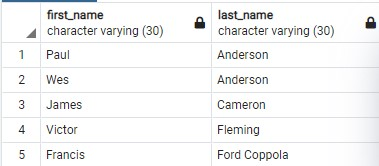
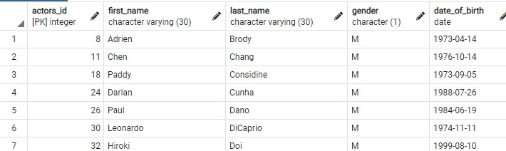
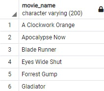
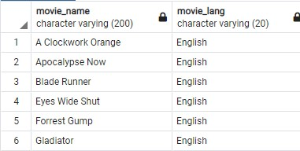
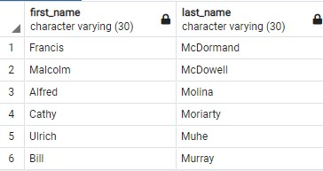
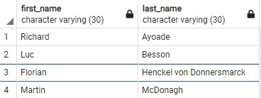

<h2>Part1:</h2>

 
<h2>Part2</h2>
<ol>

<li>SELECT movie_name,release_date FROM movies;</li>

<b>53 records</b>

 

<li>SELECT first_name, last_name FROM directors WHERE nationality = 'American';</li>

<b>16 records</b>

 

<li>SELECT * FROM actors WHERE date_of_birth > '1970-01-01' and gender = 'M';</li>

<b>31 records</b>

 

<li>SELECT movie_name FROM movies WHERE movie_length > 90 and movie_lang = 'English';</li>

<b>37 records</b>

 
</ol>

<h2>PART 3:</h2>
<ol>

<li>SELECT movie_name, movie_lang FROM movies WHERE movie_lang = 'English' or movie_lang = 'Korean' or movie_lang = 'Spanish';</li>

<b>40 Records</b>

 

<li>SELECT first_name, last_name FROM actors WHERE (last_name LIKE 'M%') AND date_of_birth BETWEEN '1940-01-01' AND '1969-12-31';</li>

<b>6 Records</b>

 

<li>SELECT first_name, last_name FROM directors WHERE nationality IN ('German','British','French') AND date_of_birth BETWEEN '1950-01-01' AND '1980-12-31';</li>

<b>4 Records</b>

</ol>