<!-- SELECT movie_lang, MAX(movie_length) from movies
WHERE movie_length <120 and movie_lang in ('English','Japanese','Chinese')
GROUP BY movie_lang -->
<ol>
<li>
<ol>
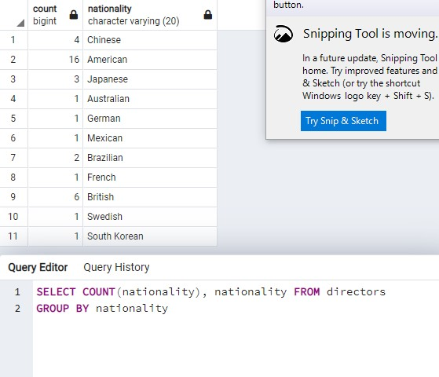
<li>
SELECT nationality, count(directors) from directors
GROUP BY nationality
</li>
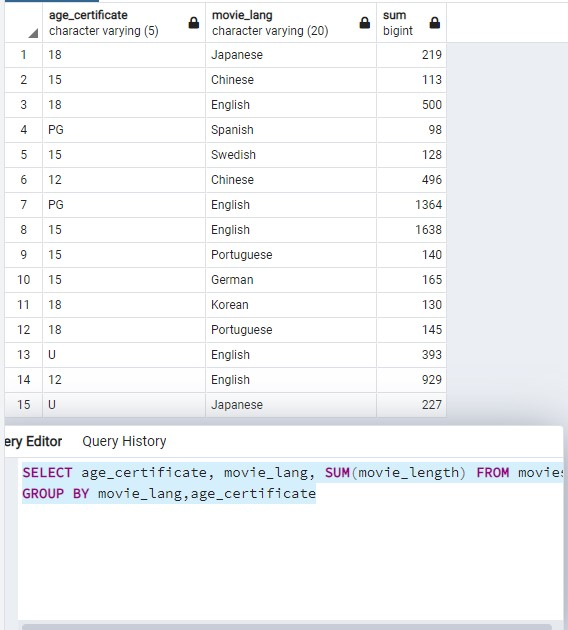
<li>
SELECT age_certificate, movie_lang, SUM(movie_length) FROM movies
GROUP BY movie_lang,age_certificate
</li>
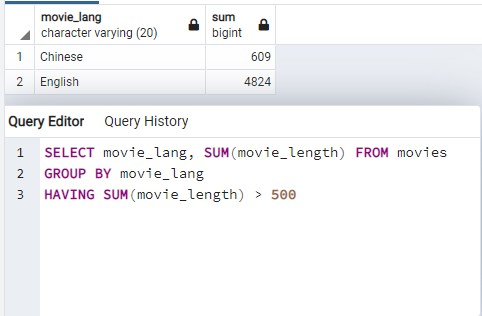
<li>
SELECT movie_lang, SUM(movie_length) FROM movies
GROUP BY movie_lang
HAVING SUM(movie_length) > 500
</li>
</ol>
<li>
<ol>

<li>
SELECT directors.first_name, directors.last_name,movies.release_date, movies.movie_name
FROM movies
JOIN directors
ON directors.director_id = movies.director_id
WHERE movie_lang in ('Chinese','Korean','Japanese')
</li>
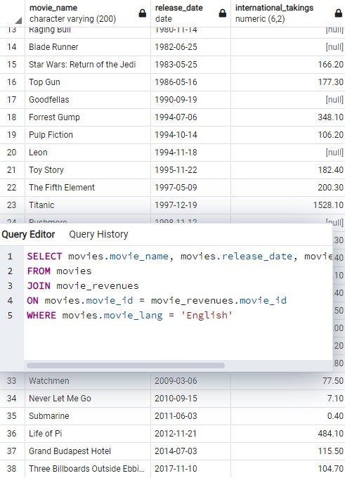
<li>
SELECT movies.movie_name, movies.release_date, movie_revenues.international_takings
FROM movies
JOIN movie_revenues
ON movies.movie_id = movie_revenues.movie_id
WHERE movies.movie_lang = 'English'
</li>
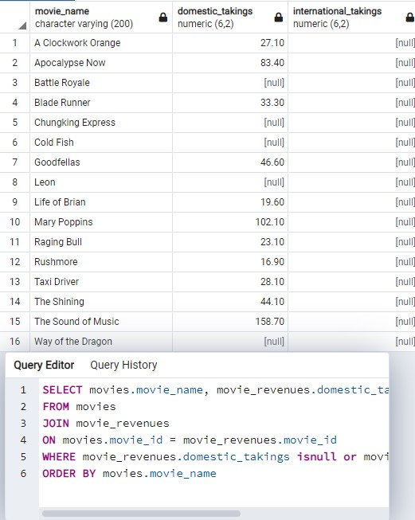
<li>
SELECT movies.movie_name, movie_revenues.domestic_takings, movie_revenues.international_takings
FROM movies
JOIN movie_revenues
ON movies.movie_id = movie_revenues.movie_id
WHERE movie_revenues.domestic_takings isnull or movie_revenues.international_takings isnull
ORDER BY movies.movie_name
</li>

<li>
SELECT COUNT(movies.movie_name), directors.first_name || ' ' || directors.last_name as Director
FROM movies
JOIN directors
ON movies.director_id=directors.director_id
GROUP BY directors.director_id
</li>
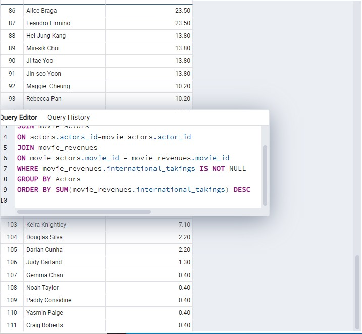
<li>
SELECT actors.first_name || ' ' || actors.last_name as Actors, SUM(movie_revenues.international_takings) as res
FROM actors
JOIN movie_actors
ON actors.actors_id=movie_actors.actor_id
JOIN movie_revenues
ON movie_actors.movie_id = movie_revenues.movie_id
WHERE movie_revenues.international_takings IS NOT NULL
GROUP BY Actors
ORDER BY SUM(movie_revenues.international_takings) DESC
LIMIT 3
</li>
</ol>
</li>
<li>
<ol>
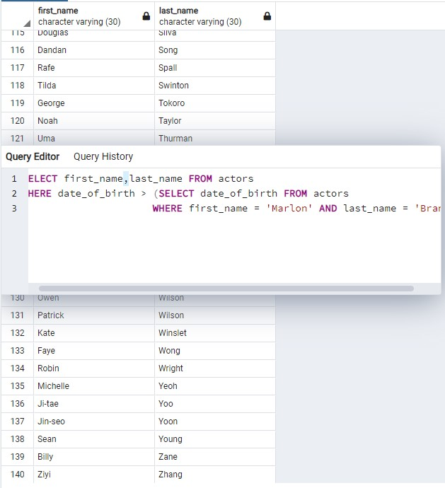
<li>
SELECT first_name,last_name FROM actors
WHERE date_of_birth > (SELECT date_of_birth FROM actors
					  WHERE first_name = 'Marlon' AND last_name = 'Brando')
</li>
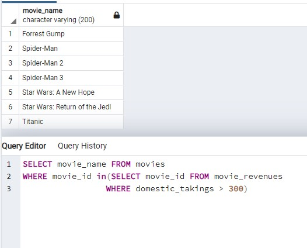
<li>
SELECT movie_name FROM movies
WHERE movie_id in(SELECT movie_id FROM movie_revenues
				 WHERE domestic_takings > 300)
</li>
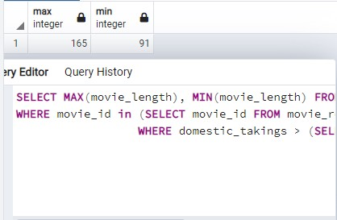
<li>
SELECT MAX(movie_length), MIN(movie_length) FROM movies
WHERE movie_id in (SELECT movie_id FROM movie_revenues
				  WHERE domestic_takings > (SELECT AVG(domestic_takings) FROM movie_revenues))
</li>
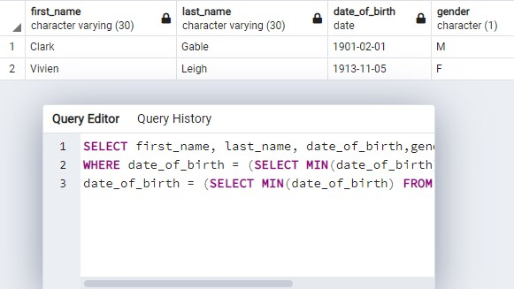
<li>
SELECT first_name, last_name, date_of_birth,gender FROM actors
WHERE date_of_birth = (SELECT MIN(date_of_birth) FROM actors WHERE gender = 'M') OR
date_of_birth = (SELECT MIN(date_of_birth) FROM actors WHERE gender = 'F')
clark gable and vivien leigh
</li>
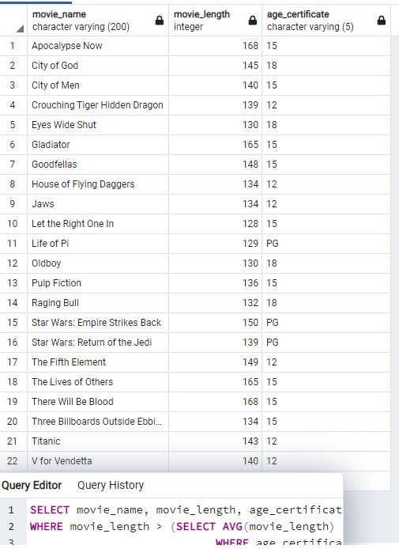
<li>
SELECT movie_name, movie_length, age_certificate  FROM movies
WHERE movie_length > (SELECT AVG(movie_length) FROM movies
							WHERE age_certificate in (SELECT age_certificate FROM movies))
23 Records
</li>
</ol>
</li>
</ol>

<h3>Project Idea</h3>

Partner: Luke Nam

Stack: Django, javascript, HTML/CSS, PostGRES, jquery

Create a pantry with CRUD. Allow user to update/add/delete their pantry. Find recipe found on spoonacular.
